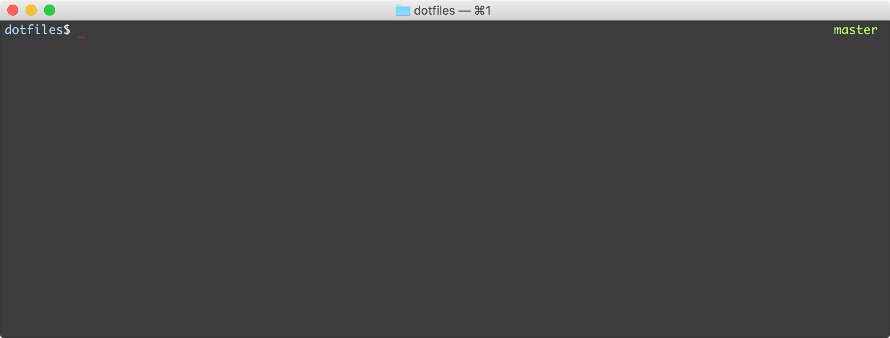

# dotfiles

These are config files to set up a system the way I like it. It include config files for zsh, brew, gem, git and theme terminal.

<p align="center">
	
</p>

## Setup
```terminal
$ sh setup.sh
```
## Acknowledgements

dotfiles config based on [Sam Soffes](https://github.com/soffes/dotfiles), [Esteban Torres](https://github.com/esttorhe/dotfiles), [Keith Smiley](https://github.com/keith/dotfiles), and [Mathias Bynens](https://github.com/mathiasbynens/dotfiles).

## License

dotfiles is available under the MIT license. See the [LICENSE](https://raw.githubusercontent.com/fdzsergio/dotfiles/master/LICENSE) file for more info.
